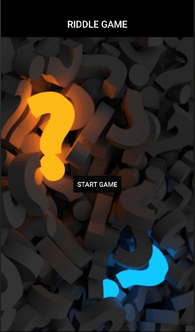

# RIDDLE GAME

## **_Descrição do projeto_**
<br>
App desenvolvido desenvolvido com React Native. De forma simplória, o app é um jogo de charadas. Feito com intuito de práticar o uso de navigation.

Ao inciar temos uma homepage onde veremos um botão **_"STARTGAME"_**.Ao clicar somos redirecionados a tela de dicas,
após a tela de dicas incia-se o jogo.

O jogo é simples, temos uma charada e um input de texto onde você deve por a resposta, ao clicar em **_"CHECK"_** terá uma verificação entre o que foi digitado no input e resposta correta.  Caso a resposta esteja errada será direcionado a tela **_"FAIL"_** e caso esteja correta a tela será **_"CONGRATS"_**.


#

## **_Recursos_**

- [React Native](https://reactnative.dev/docs/getting-started)
- [Expo](https://docs.expo.dev)
- [Navigation](https://reactnavigation.org/docs/getting-started/)
- [Android Studio](https://developer.android.com)

#

>#### _Ao final do documento deixarei as respostas dos desafios propostos._

<br>



```
(LVL0)
  question: "Estou no início da rua, no fim do mar e no meio da cara.",
  answer: "r",
```

```
(LVL1)
  question:
    "Diga-me se for capaz. Diga-me quem é aquele que num instante se quebra se alguém diz o nome dele.",
  answer: "silêncio",
```

```
(LVL2)
  question:
    " Fruta vermelha, doce e saborosa. Quando está madura fica mais gostosa.",
  answer: "caqui",
```

```
(LVL3)
  question: "Quanto mais se enche, menor fica.",
  answer: "paciência",
```

```
(LVL4)
  name: 4,
  question: "É feito para andar, mas não anda.",
  answer: "rua",
```

```
(LVL5)
  question:
    "Na cidade é uma profissão, na estrada é um perigo e na mata um inseto.",
  answer: "barbeiro",
```

```
(LVL6)
  question:
    "O Sr. Smith tem 4 filhas. Cada uma de suas filhas tem 1 irmão. Quantos filhos Sr. Smith tem ao todo?",
  answer: "cinco",
```

```
(LVL7)
  name: 7,
  question: "O que o boi usa na cabeça para ficar estiloso?",
  answer: "boina",
```

```
(LVL8)
  question:
    "Sou uma ave bonita, tente meu nome escrever, leia de trás para a frente e o mesmo nome irá ver.",
  answer: "arara",
```

```
(LVL9)
question:
"O que jogamos fora quando precisamos, e pegamos de volta quando não queremos mais?",
answer: "âncora",

```

```
(LVL10)
question:
  question:
    "Dois pais e dois filhos sentaram-se para comer ovos no café da manhã. Cada um comeu um ovo. Quantos ovos eles comeram no total?",
  answer: "três",

```
